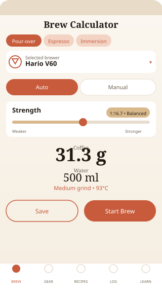
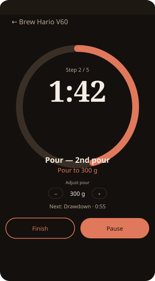
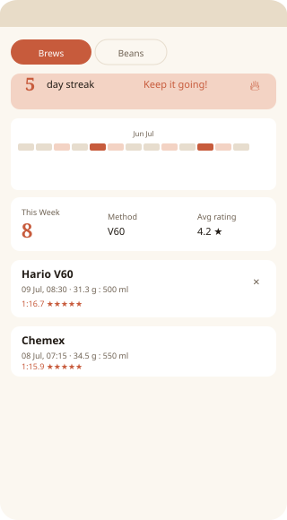
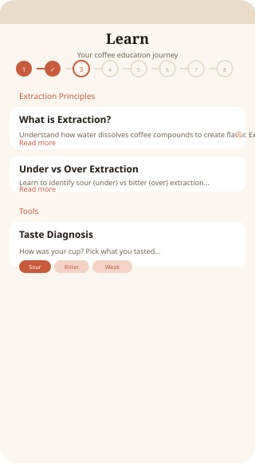

<p align="center">
  <br>
  
  
  
</p>

# Coffeery

Local-first Android brewing companion — pick your gear, dial in strength and roast, get an exact recipe, and follow a step-by-step timed brew with per-pour adjustment, background notifications, and full brew journaling. Works fully offline; optional Google Sign-In enables cloud backup to Drive.

## Highlights

- **69 brewing methods** — 28 pour-over + 11 pressure + 7 immersion + 23 other (incl. 10 new: Hario Mugen, Graycano, Kinto Slow, Fellow Aiden, Kalita 102, Espro Bloom, Bripe Pipe, SCA Cupping Set, Modbar Pour-Over, Timemore B75 + pillars Pulsar/Tricolate/Delter/Flair/Moccamaster/Nel/Gina/Hoop/Paragon/Melodrip/December/Hario Switch/AeroPress XL/Flair58/Nanopresso/Phoenix70/Lunar) + 12 equipment-free methods (Cowboy, Cupping, Cloth, Sock, Decoction, Paper Towel, Egg, Improvised Turkish, Kopi Tubruk, Qahwa, Cafe de Olla, Mason Jar)
- **Custom gear** — add your own brewer with category defaults, auto-generated steps, and a 25-icon picker
- **Live ratio recalculation** — three-field input (coffee / ratio / water) with instant cross-recalculation in manual mode, or strength-slider auto mode; ratio card with visual feedback
- **Step-by-step brew timer** — per-method timed steps, pour targets, per-pour ±5% water adjustment, merge-pours mode, customizable step durations (bloom/pour/steep/drawdown), auto-advance toggle, step indicator with pulse animation, sound (custom chimes) + dual-tap haptic + vibration alerts
- **Hands-free timer** — proximity sensor control to advance steps without touching the screen
- **Background brewing** — foreground service with persistent notification keeps the timer running when minimized
- **YouTube tutorials** — every method links to a verified recipe video in English and Turkish (72 links)
- **Brew journal** — log every brew with rating, tasting notes, grind size, linked bean, and **photo capture**; 12-week calendar heatmap, streak counter, analytics card, caffeine tracker with safe-zone indicator, best-recipe suggestion; **compare brews**, **share card** (text + image), **PDF brew report export**, CSV export
- **Bean inventory** — track beans with origin, roaster, roast date; dedicated Bean Detail screen
- **Achievements & stats** — stats dashboard and achievement system with streak polish and brew reminders
- **Learn — 140 knowledge cards across 14 chapters** (Basics, Grinding, Water, Extraction, Methods, Milk, Tasting, Caffeine, Equipment, Water Deep Dive, Sustainability, Espresso, Processing, Origins) with locked/unlocked step-map, **30+ quizzes** with score tracker, Today's Lesson + Quiz, random lesson button, extraction calculator, water chemistry guide, 114-term glossary, 75 rotating pro tips, grind size visual, brew troubleshooter, 30+ note flavor wheel, food pairings, culture facts, varietal wheel (22 profiles)
- **Drinks — 90 drink recipes** (31 milk-based + 59 regional) with full ingredient steps, **22 coffee variety profiles** with origin and flavor notes
- **Search** — real-time text filter on Equipment, Learn, and Drinks screens
- **Full i18n** — 1,229 strings each in English (default) + Turkish
- **Cloud backup (optional)** — Google Sign-In (profile photo in header, silent sign-in) with Google Drive backup/restore: auto-backup on sign-in + manual backup/restore from Settings; fixed debug keystore for consistent SHA-1
- **Zero Material Design** — custom `CoffeeColors` / `CoffeeTypography` / `CoffeeShapes` design system, 25 selectable palettes (Terracotta / Espresso / Matcha / Berry / Crema / Mocha / Caramel / Hazelnut / Copper / Cinnamon / Chestnut / French Roast / Vanilla Latte / Pumpkin Spice / Nordic Light / Kinetic / Midnight Bloom / Aurora / Steam / Honey / Velvet / Crema Rose / Smoke / Ember / Miuix) with light + dark warm gradient backgrounds, grain texture, vintage accent, spring/motion tokens, 69 hand-drawn Canvas line-art equipment icons, and Fraunces + Manrope serif display typography

## Screens

<p align="center">
  
  
  
  
</p>

| Brew Calculator | Timer | Brew Log | Learn | Settings |
|---|---|---|---|---|
| Category tabs, auto/manual ratio, strength slider, roast picker, dual-line segmented pills, ratio card, one-tap save, YouTube links | 72sp hero countdown in 260dp progress ring + pulse, per-pour adjustment, merge-pours, customizable durations, step indicator, auto-advance, haptics + chimes, proximity hands-free, background service, save-to-log dialog with bean picker + photo | Calendar heatmap, streak banner, analytics card, caffeine tracker, best-recipe suggestion (tap to apply), comparison tool, share card, PDF export, bean inventory, CSV export/import, achievements & stats tabs | 14-chapter step-map, 140 lessons, 30+ quizzes (score + streak + random), Today's Lesson, extraction calculator, water chemistry, 114-term searchable glossary, pro tips, grind visual, troubleshooter, flavor wheel, food pairing & culture, varietal wheel | 25 palette 2-col grid (112dp split light/dark preview), warm gradient backgrounds, dark/light/system toggle, language switch, brew customization, Google Sign-In + Drive backup/restore (auto-retry), data export/import |

## Architecture

MVVM with a single source of truth and unidirectional data flow.

```
app/src/main/java/co/coffeery/app/
├── data/
│   ├── local/    Room (5 entities, 5 DAOs, schema v9), PresetLoader
│   ├── model/    Equipment, BrewStepDef, enums (Grind, RoastLevel, etc.)
│   └── repo/     CoffeeRepository (built-ins + custom gear, export/import/CSV)
├── service/      TimerService (foreground), TimerStopReceiver
├── ui/
│   ├── theme/    Color (25 palettes × 2 = 50 profiles), Type (Fraunces/Manrope 32/18/12), Shape, Texture (gradient + grain linen), Motion (press/cardExpand/page/counter/chipSelect)
│   ├── components/ 69 icons, buttons, cards, sliders, segmented controls
│   └── screens/  brew (calculator + timer), equipment, recipes, log (timeline + stats + achievements + bean detail), learn (content + tools + quizzes), drinks, onboarding, root (nav + settings)
└── util/         BrewMath (recipe engine), BrewPdfExporter, CloudBackupManager, Format, AppHaptics
```

## Tech

| | |
|---|---|
| Language | Kotlin 2.3.0 |
| UI | Jetpack Compose BOM 2024.09.03 (Foundation only — no Material) |
| SDK | min 26 / target 35 / compile 35 |
| Build | Gradle 8.13, AGP 8.13.2, KSP 2.3.9 |
| DB | Room 2.7.2 (v9 schema) |
| Lifecycle | 2.10.0 |
| Auth / Cloud | Google Sign-In + Google Drive (google-api-client, drive SDK, fixed debug keystore) |
| JDK (CI) | 17 Temurin |
| CI/CD | GitHub Actions — debug + release APK on every push |
| APK | ~4.7 MB (release, R8 minified + resource shrunk) |
| Codebase | ~10,900 lines Kotlin · 1,667 lines JSON presets · 1,229 strings |
| i18n | 1,229 strings EN/TR |
| Version | 3.0.1 (versionCode 6) |

## What's New (from git history)

> Last 30 commits — condensed. See `git log --oneline` for full history (205 commits).

- **Learn expansion** — 150 quizzes, streak counter, random button, timer pulse, ratio card (`3746978`); +20 and +18 quiz batches (`5ad31fc`, `ac25d26`); 7 more quizzes + score tracker (`f291667`); food pairing + culture facts + brew comparison + share card (`4a704d8`)
- **Timer & journal** — PDF brew report + hands-free proximity timer (`3d0b678`); photo capture in save dialog + flavor tags + photo display in log (`b1c89d3`); step indicator polish (`8cf7064`); Bean Detail, Today's Lesson/Quiz, empty states (`2830af7`); custom chimes, haptics, grain texture (`350359b`)
- **Cloud** — Google Sign-In + Drive backup/restore with auto-backup and manual buttons (`d9a908b`, `f68d174`), fixed debug keystore for stable SHA-1 (`816daec`), Play Services + `requestIdToken` hardening and 403 fix (`247bbd2`, `1a64969`)
- **Content** — +8 drinks (`e801022`), +10 pro tips / +10 glossary / +2 brew issues (`4472fd5`), research docs cleanup (`98cc67d`)
- **Fixes** — animateFloat/width imports, scope declarations, R8/META-INF rules, nested scroll, ExperimentalLayoutApi opt-ins, share template

## Build

CI builds both debug and release APKs on every push and uploads them as artifacts.

```bash
./gradlew assembleDebug      # debug APK
./gradlew assembleRelease    # release APK (R8 minified)
```

Keystore: `app/debug.keystore` is checked in for consistent Google Sign-In SHA-1 in CI. Set `google_server_client_id` in `local.properties` (or `GOOGLE_SERVER_CLIENT_ID` env) — also available as `BuildConfig.GOOGLE_SERVER_CLIENT_ID`; the `google_server_client_id` string resource remains as fallback for real sign-in.

## License

MIT
